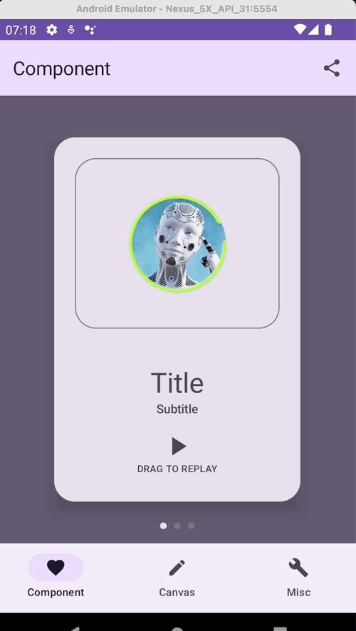

# AiNimations - Hackweek #21

## Introduction

An app for showcasing Animations created with the assistance and tools that artificial intelligence offers nowadays. This project is part of the special edition of the hackweek at XING related with Ai. 

### Reasoning
In the XDS Team we need to implement complex animations for our components. And we have fantastic ones already implemented. When done right, animations can attract user’s attention, improve their experience, and reduce cognitive load. I believe that there is still much room for improvement in terms of animations in the XING product, and therefore, I would like to dig deeper into this topic during this week, taking into account, of course, the assistance and tools that artificial intelligence offers nowadays: Chat GPT and Copilot specially.

Check the [hackweek project](https://innovation.xing.io/ui/project/3069) for further information. Or see the [video](https://xingag.sharepoint.com/:v:/r/sites/NWAll/Freigegebene%20Dokumente/HackWeek/HW%2321%20Friday%20Video%20Presentation/3069_AiNimations.mp4?csf=1&web=1&e=Zd06zg) presentation.

## Tech Stack
- Kotlin, Kotlin Script 
- Ktlint, Detekt and Compose Lints
- Jetpack Compose
- Compose Navigation and Navigation Bar
- Horizontal Pager
- And Ai support as Copilot and Chat GPT

## Documentation
You can find the technical documentation in the [`/docs/README.md`](docs/README.md) file.

## Author
David Asensio - May 2023
